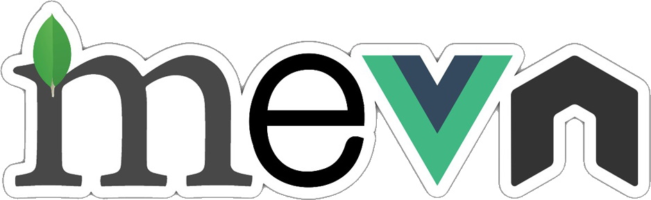

<div align="center">
  <a href="https://madewithvuejs.com/mevn-cli" rel="noopener">
    
  </a>
</div>

<h1 align="center">Tutorial CRUD MEVN</h1>

<div align="center">

[](https://www.mongodb.com/)
[](https://expressjs.com/)
[](https://vuejs.org/)
[](https://nodejs.org/)

</div>

<div align="center">
  Tutorial de un mantenedor usando el stack MEVN.
</div>

## 📘 Últimas actualizaciones 👀 
- Documentación creada.

## 📝 Contenidos 📂 

- [¿Qué es este proyecto?](#about)
- [¡Empecemos!](#getting_started)
- [Prerequisitos](#prerequisites)
- [Instalación](#installing)
- [¿Cómo usar?](#usage)
- [Capturas de pantalla](#screenshots)
- [Producción](#deployment)
- [Contribuir](../CONTRIBUTING.md)
- [Tecnologías usadas](#built_using)
- [Autores](#authors)
- [Reconocimientos](#acknowledgement)

## 🧐 ¿Qué es CRUD MEVN ? <a name = "about"></a>

Este proyecto se basa en un mantenedor (también llamado CRUD) que utiliza uno de los stacks de programació más famosos del último tiempo, MEVN (MongoDB, Express, Vue3 & Node). Se siguieron los pasos del tutorial del sitio [signoz.io](https://signoz.io/blog/mevn-stack-tutorial/) para gran parte de este código.

<div align="center">
  <a href="https://www.arkasoftwares.com/mevn-stack-development" rel="noopener">
    
  </a>
</div>

## 🏁 ¡Empecemos! <a name = "getting_started"></a>

Sigue las siguientes instrucciones para ejecutar el proyecto.

### 📘 Prerequisitos <a name = "prerequisites"></a>

- Instalar [Git](https://git-scm.com/downloads)

- Instalar [Node](https://nodejs.org/en/download/)

- Instalar [Mongo](https://www.mongodb.com/try/download/community)

###  🔧 Instalación <a name = "installing"></a>

Primero clonar este proyecto.

```sh
git clone https://github.com/Marfullsen/crud_mevn
cd crud_mevn
```

Instalar las dependencias del cliente y servidor.

```sh
cd client
npm install
cd ..
cd server
npm install
```

## 🎈 Modo de uso <a name = "usage"></a>

Para levantar el proyecto en modo desarrollo.

```sh
cd server
npm run dev
```

Ahora entrar al enlace que aparece en consola. [http://127.0.0.1:8080/](http://127.0.0.1:8080/)

**Nota**: el server correrá en paralelo. [http://127.0.0.1:3000/](http://127.0.0.1:3000/)

**Nota 2**: Mongo debiera ya estar funcionando. [mongodb://localhost:27017/](mongodb://localhost:27017/)

## Capturas de pantalla

### Pantalla principal

  

---

### Un item agregado, escribiendo el segundo...

  

---

### Dos items agregados

  

## 🚀 Producción <a name = "deployment"></a>

Se está investigando la mejor manera de pasar todo a producción.

## ⛏️ Tecnologías usadas <a name = "built_using"></a>

- [MongoDB](https://www.mongodb.com/) - Base de datos
- [Express](https://expressjs.com/) - Framework de servidores
- [Vue.js](https://vuejs.org/) - Framework para cliente
- [NodeJs](https://nodejs.org/) - Entorno del servidor

<div align="center">
  <a href="https://www.fiverr.com/stackcircle/create-mevn-stack-applications-for-your-business" rel="noopener">
    
  </a>
</div>

## ✍️ Autores 👌 <a name = "authors"></a>

- [Marfullsen](https://github.com/Marfullsen) - Programador MEVN.


## 🎉 Reconocimientos, agradecimientos y más. <a name = "acknowledgement"></a>

- MEVN stack tutorial | [Build a CRUD app using Vue 3, Node, Express & MongoDB](https://signoz.io/blog/mevn-stack-tutorial/)
- MongoDB: [qué es, cómo funciona y cuándo podemos usarlo (o no)](https://www.genbeta.com/desarrollo/mongodb-que-es-como-funciona-y-cuando-podemos-usarlo-o-no)
- https://madewithvuejs.com/mevn-cli
- https://www.fiverr.com/stackcircle/create-mevn-stack-applications-for-your-business
- https://dev.to/amrelmohamady/mean-vs-mern-vs-mevn-stacks-what-s-the-difference-29ge